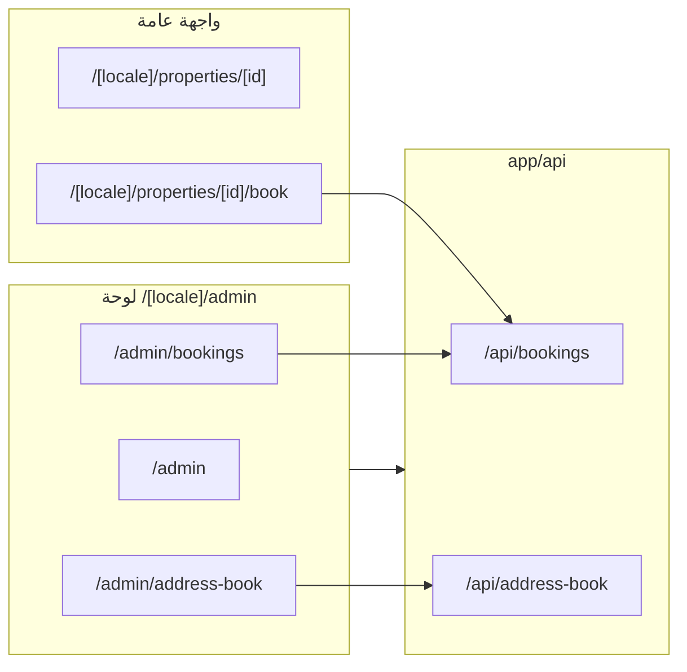

# سيناريوهات الموقع وربط الصفحات — BHD-OM
# Site Scenarios, Page Links & Consistency Guide

هذا الملف مرجع مركزي لـ **كيف يعمل الموقع** و**كيف تُربط الصفحات** و**معايير التصميم والتنسيق** حتى لا نفقد التصميم والترابط عند التحديث أو إضافة صفحات جديدة.

---

## 0. هيكل المشروع (Next.js App Router) ومصدر التنقل

### 0.1 شجرة المجلدات المعنية بالصفحات

كل الصفحات المعروضة للمستخدم تقع تحت **`app/[locale]/`** (العربية/الإنجليزية عبر `i18n`). الجذر `app/page.tsx` يوجّه للوكيل الافتراضي.

```
app/
├── page.tsx                          # إعادة توجيه للوكيل
├── [locale]/
│   ├── layout.tsx                    # خطوط، مزودو السياق، intl
│   ├── page.tsx                      # الرئيسية
│   ├── login/ | register/ | forgot-password/
│   ├── about/ | contact/ | services/ | subscriptions/
│   ├── properties/
│   │   ├── page.tsx
│   │   └── [id]/
│   │       ├── page.tsx
│   │       ├── book/ | viewing/ | receipt/ | upload-documents/ | contract-terms/
│   ├── projects/ | projects/[id]/
│   ├── scan/[userId]/ | scan/property/[id]/
│   ├── impersonate/ | auth/impersonate/
│   ├── sign/[token]/
│   ├── test/                         # اختبار (إن وُجد)
│   └── admin/
│       ├── page.tsx                  # لوحة التحكم الرئيسية
│       ├── accounting/ (+ accounts, journal, reports تحت نفس المسار بتبويبات)
│       ├── address-book/ | bank-details/ | company-data/ | document-templates/ | site/
│       ├── analytics/ | reports/ | security/ | services/ | contact/ | submissions/
│       ├── backup/ | data/ | drafts/ | migrate-serials/
│       ├── bookings/ | contracts/ | contracts/[id]/ | contract-review/
│       ├── dashboard-settings/ | contact-category-permissions/
│       ├── maintenance/ | notifications/
│       ├── my-account/ | my-bookings/ | my-contracts/ | my-properties/ | my-invoices/ | my-receipts/
│       ├── properties/ | properties/new/ | properties/[id]/ | properties/[id]/bookings/ | …/terms/ | …/extra-data/
│       ├── projects/ | projects/new/
│       ├── subscriptions/ | users/ | users/[id]/
│       └── serial-history/
├── api/                              # مسارات API (لا تمر عبر [locale])
```

**طبقات مشتركة:** `components/` (واجهات)، `lib/` (منطق، إعدادات)، `prisma/` (مخطط وقاعدة)، `messages/` (ترجمة `next-intl`).

### 0.2 من أين تُبنى قائمة لوحة التحكم؟

| المصدر | الدور |
|--------|--------|
| **`lib/config/adminNav.ts`** | قائمة مسطّحة + مجموعات (لوحة، محاسبة، عقارات، مشاريع) — `getAdminNavGroupsConfig()` |
| **`lib/config/dashboardRoles.ts`** | أي أقسام تظهر لعميل / مالك / أدمن (`DashboardSectionKey`) |
| **`app/[locale]/admin/AdminLayoutInner.tsx`** | الشريط الجانبي، الجلسة، `RoleBasedSidebar` حسب الدور |
| **`components/admin/RoleBasedSidebar.tsx`** | عرض المجموعات حسب الصلاحيات |

**قاعدة:** مسار جديد تحت `/admin` يجب تسجيله في `adminNav.ts` (و`dashboardRoles` عند الحاجة) حتى يظهر في القائمة وفي «إعدادات لوحات التحكم».

### 0.3 مخطط تدفق الصفحات (عام ↔ لوحة ↔ API)



---

## 1. خريطة الصفحات والروابط (Site Map)

### الواجهة العامة (بدون تسجيل)

| المسار | الوصف | روابط خارجة مهمة |
|--------|------|-------------------|
| `/[locale]` | الصفحة الرئيسية | العقارات، المشاريع، الخدمات، التواصل، الاشتراكات، تسجيل الدخول |
| `/[locale]/properties` | قائمة العقارات | تفاصيل العقار، الحجز، المعاينة |
| `/[locale]/properties/[id]` | تفاصيل العقار | **احجز** → `/properties/[id]/book`، **معاينة** → `/properties/[id]/viewing` |
| `/[locale]/properties/[id]/book` | صفحة حجز الوحدة + الدفع | بعد الدفع: إيصال، حفظ الحجز في DB وربطه بالمحاسبة |
| `/[locale]/projects` | قائمة المشاريع | تفاصيل المشروع |
| `/[locale]/projects/[id]` | تفاصيل المشروع | — |
| `/[locale]/services` | الخدمات | — |
| `/[locale]/contact` | التواصل | — |
| `/[locale]/about` | عن الشركة | — |
| `/[locale]/subscriptions` | الباقات والاشتراكات (عامة) | اختيار باقة، قد يوجّه للدفع أو للتسجيل |
| `/[locale]/login` | تسجيل الدخول | بعد النجاح → `/admin` |
| `/[locale]/register` | التسجيل | — |
| `/[locale]/forgot-password` | استعادة كلمة المرور | — |
| `/[locale]/properties/[id]/receipt` | إيصال/عرض بعد دفع | حسب تدفق الحجز |
| `/[locale]/properties/[id]/upload-documents` | رفع مستندات | مرتبط بالحجز/العقد |
| `/[locale]/properties/[id]/contract-terms` | شروط العقد | — |
| `/[locale]/scan/[userId]` | مسح باركود مستخدم | — |
| `/[locale]/scan/property/[id]` | مسح باركود عقار | — |
| `/[locale]/impersonate` · `/[locale]/auth/impersonate` | فتح حساب مستخدم (أدمن) | جلسة منتحلة |
| `/[locale]/sign/[token]` | توقيع/رابط موقّع | — |

### لوحة التحكم (بعد تسجيل الدخول) — `/admin`

القائمة الجانبية تُبنى من **`lib/config/adminNav.ts`** و**`lib/config/dashboardRoles.ts`**. إضافة صفحة جديدة تتم من هناك (انظر القسم 4).

| المسار | الوصف | روابط خارجة / تدفق |
|--------|------|---------------------|
| `/[locale]/admin` | لوحة التحكم الرئيسية | حسب الدور: عميل/مالك/أدمن — روابط إلى الحجوزات، العقود، المحاسبة، الاشتراكات، إلخ |
| `/[locale]/admin/my-account` | حسابي — بياناتي + الباقة | ترقية/تنزيل الباقة → نافذة الباقات → الدفع (نفس واجهة حجز العقار) → إيصال اشتراك في المحاسبة |
| `/[locale]/admin/my-bookings` | حجوزاتي (عميل) | من تفاصيل الحجز → مستندات، عقود |
| `/[locale]/admin/my-contracts` | عقودي | — |
| `/[locale]/admin/my-properties` | عقاري (مالك) | — |
| `/[locale]/admin/address-book` | دفتر العناوين | جهات الاتصال — تُربط بالفواتير والحجوزات والعقود |
| `/[locale]/admin/bank-details` | التفاصيل البنكية | تُربط بالمحاسبة وطرق الدفع |
| `/[locale]/admin/accounting` | نظام المحاسبة | تبويبات: لوحة التحكم، قيود، مستندات، حسابات، تقارير. **لوحة التحكم** تعرض حجوزات بانتظار تأكيد المحاسب |
| `/[locale]/admin/accounting?tab=dashboard` | لوحة تحكم المحاسبة | تأكيد استلام مبالغ الحجز → يحدّث الحجز في DB ويظهر في الحجوزات |
| `/[locale]/admin/accounting?tab=journal` | قيود اليومية | — |
| `/[locale]/admin/accounting?tab=documents` | المستندات | — |
| `/[locale]/admin/accounting?tab=accounts` | دليل الحسابات | — |
| `/[locale]/admin/bookings` | إدارة الحجوزات (أدمن) | حجوزات من كل المصادر؛ بعد تأكيد المحاسب تظهر بحالة «مؤكد الدفع» ويُكمل إدخال البيانات |
| `/[locale]/admin/properties` | إدارة العقارات | عقار جديد، حجوزات العقار، عقود |
| `/[locale]/admin/properties/[id]/bookings` | حجوزات عقار معيّن | طلب مستندات، اعتماد، إنشاء عقد |
| `/[locale]/admin/contracts` | إدارة العقود | — |
| `/[locale]/admin/subscriptions` | إدارة الاشتراكات (أدمن) | المستخدمون والخطط؛ تنزيل الباقة يتطلب استرداد المبلغ في المحاسبة أولاً |
| `/[locale]/admin/users` | إدارة المستخدمين | صف مستخدم: `/admin/users/[id]` — دفتر العناوين، فتح حساب، ضمان سجل |
| `/[locale]/admin/users/[id]` | تفاصيل مستخدم (أدمن) | ربط بدفتر العناوين، تعديل، إعادة تعيين كلمة المرور |
| `/[locale]/admin/properties/[id]` | تفاصيل عقار (إدارة) | حجوزات العقار، بيانات إضافية |
| `/[locale]/admin/properties/[id]/extra-data` | بيانات إضافية للعقار | — |
| `/[locale]/admin/properties/[id]/bookings` | حجوزات عقار | شروط/مراحل حسب المسار الفرعي |
| `/[locale]/admin/contracts/[id]` | تفاصيل عقد | — |
| `/[locale]/admin/contract-review` | مراجعة عقود | — |
| `/[locale]/admin/drafts` | المسودات | `draftStorage` |
| `/[locale]/admin/migrate-serials` | ترحيل أرقام تسلسلية | أدمن |
| `/[locale]/admin/my-invoices` · `my-receipts` | فواتيري / إيصالاتي | عميل |
| `/[locale]/admin/contact-category-permissions` | صلاحيات تصنيفات جهات الاتصال | أدمن |
| `/[locale]/admin/serial-history` | سجل الأرقام التسلسلية | — |
| `/[locale]/admin/data` | **إدارة البيانات والنسخ الاحتياطي (الخادم)** | تصفير DB مع الإبقاء على العقارات (`ADMIN_DATA_RESET_PIN`)؛ نسخة JSON كاملة؛ استعادة؛ منفصل: تصفير تشغيلي لـ localStorage. التفصيل: `docs/اقرأني-الدليل-التقني-الشامل.md` |
| `/[locale]/admin/backup` | نسخ احتياطي (واجهة قديمة/محلية إن وُجدت) | يُفضّل استخدام `/admin/data` للخادم |
| `/[locale]/subscriptions` | الباقات (للعميل/مالك) | نفس الصفحة العامة لكن من داخل اللوحة |

**ملاحظة**: كل المسارات أعلاه تسبقها `[locale]` (مثل `ar` أو `en`)، مثال: `/ar/admin/accounting`.

---

## 2. السيناريوهات الرئيسية (كيف يعمل الموقع)

### 2.1 سيناريو الحجز من الموقع حتى العقد

1. **المستخدم (زائر)** يفتح تفاصيل العقار → يضغط **احجز** → `/[locale]/properties/[id]/book`.
2. **صفحة الحجز**: يختار الوحدة، يدخل بياناته (أو يربط بجهة اتصال)، يدخل بيانات الدفع — يُنشأ حجز ويُرسل إلى الخادم `POST /api/bookings` مع `paymentConfirmed` و`priceAtBooking` و`contactId`.
3. **الخادم**: يحفظ الحجز في `BookingStorage` (Prisma)، ويُنشئ إيصالاً محاسبياً تلقائياً (`createBookingReceiptInDb`) مرتبطاً بالحجز (`reference: booking:{id}`).
4. **المحاسب**: يفتح **لوحة المحاسبة** → تبويب **لوحة التحكم** → يرى قائمة «تأكيد استلام مبالغ الحجز» (البيانات من **API**: `GET /api/bookings/pending-confirmation`).
5. **المحاسب** يضغط **تأكيد الاستلام وتقيد الطلب** → يستدعي `POST /api/bookings/[id]/confirm-receipt` → يُحدَّث الحجز في DB (`accountantConfirmedAt`, `status: CONFIRMED`).
6. **إدارة الحجوزات**: في `/[locale]/admin/bookings` (أو من عقار معيّن) يظهر الحجز بحالة «مؤكد الدفع» — يُكمل الموظف إدخال البيانات، طلب المستندات، اعتمادها، إنشاء العقد.
7. **سير المستندات والعقد**: حسب `docs/BOOKING_WORKFLOW_DESIGN.md` — طلب مستندات → رفع من المستأجر → اعتماد → ربط مالك → إنشاء عقد → توقيع → الحجز يصبح `RENTED`.

**ربط البيانات**: الحجز مرتبط بـ `contactId`؛ الإيصال المحاسبي مرتبط بـ `reference: booking:{id}` و`contactId`؛ دفتر العناوين وبنك التفاصيل يُستخدمان في الفواتير والإيصالات.

### 2.2 سيناريو الاشتراك (باقة) ودفعها

1. **المستخدم** من **حسابي** `/[locale]/admin/my-account` يضغط **طلب ترقية الباقة** أو **طلب تنزيل الباقة**.
2. **نافذة الباقات**: يختار الخطة من قائمة الباقات (نفس المحتوى الموجود في `/[locale]/subscriptions`).
3. **إن كان مبلغاً مدفوعاً**: تفتح شاشة الدفع الموحدة (نفس تصميم دفع حجز العقار) — بعد نجاح الدفع يُرسل الطلب إلى `POST /api/subscriptions/me/change-with-payment` مع `contactId`.
4. **الخادم**: يحدّث الاشتراك ويُنشئ إيصال اشتراك في المحاسبة (حساب **4250** إيرادات الاشتراكات)، ويُسجّل في `SubscriptionHistory` مع `receiptDocumentId` و`amountPaid`.
5. **تنزيل الباقة**: إن كان المبلغ صفراً (باقة مجانية) لا يُطلب إدخال بطاقة — فقط تأكيد. إن كان المستخدم قد دفع سابقاً، لا يمكن للأدمن تنزيل الباقة حتى يُسجّل استرداد المبلغ في المحاسبة (انظر `docs/ROLES-SUBSCRIPTION-DESIGN.md` وواجهة الاشتراكات).

**ربط البيانات**: إيصالات الاشتراك تُربط بـ `contactId`؛ الحساب **4250** مخصّص لإيرادات الاشتراكات؛ **4000** لإيرادات العقارات/الإيجار.

### 2.3 سيناريو المحاسبة — من أين تأتي الأرقام

- **مصدر البيانات**: عند فتح `/[locale]/admin/accounting` تُحمّل البيانات من الخادم عبر **Server Component** (`getAccountingDataForPage` في `lib/accounting/data/dbService.ts`) بعد تشغيل المزامنات:
  - `syncPaidBookingsToAccountingDb()` — إنشاء إيصالات للحجوزات المدفوعة التي لم يُنشأ لها إيصال.
  - `syncSubscriptionHistoryToAccountingDb()` — إنشاء إيصالات لسجل الاشتراكات المدفوعة التي لا تملك `receiptDocumentId`.
- **لوحة التحكم**: تعرض الحسابات الرئيسية (1000 صندوق، 4000 إيرادات عقارات، 4250 إيرادات اشتراكات)، وقائمة «تأكيد استلام مبالغ الحجز» من **API** (لا من localStorage).
- **التأكيد**: زر «تأكيد الاستلام وتقيد الطلب» يستدعي `POST /api/bookings/[id]/confirm-receipt` ويحدّث الحجز في DB ويربط الإيصال بالحجز.

تفاصيل دليل الحسابات والاستخدام: `docs/accounting-chart-and-usage.md`.

---

## 3. معايير التصميم والتنسيق (حتى لا نفقد التناسق)

عند إضافة أو تعديل أي صفحة، يُفضّل الالتزام بما يلي حتى يبقى الموقع متناسقاً.

### 3.1 المراجع الثابتة في المشروع

| المورد | الغرض |
|--------|--------|
| **`.cursor/rules/technical-engineering-crm.mdc`** | المعايير التقنية، الترقية، السرعة، CRM |
| **`.cursor/rules/required-fields-styling.mdc`** | تنسيق الحقول الإجبارية (أحمر عند الفراغ، أخضر عند التعبئة) |
| **`.cursor/rules/draft-auto-save.mdc`** | حفظ المسودات تلقائياً وزر «حفظ» للالتزام |
| **`README.md`** | نظام الألوان، التباعد، الخطوط، Hero، العلامة المائية، الحقول الإجبارية |

### 3.2 التباعد والخط

- **مسافة بين السطور**: لا تقل عن 1.5 (`--line-height-min`).
- **بين العنوان والفقرة**: 2rem (`--space-title-paragraph`).
- **بين العناوين والصور والإطارات**: 2rem (`--space-heading-media`).

### 3.3 الألوان (ثيم الموقع)

- **Primary**: `#8B6F47` (ذهبي بني).
- **Primary dark**: `#6B5535`.
- استخدام نفس الباليت في الأزرار والعناوين والروابط النشطة في اللوحة الإدارية.

### 3.4 الروابط والتنقل

- استخدام `Link` من Next.js مع `prefetch={true}` حيث يناسب.
- المسارات مع `locale`: دائماً `/${locale}/...` (مثال: `/${locale}/admin/accounting`).
- القائمة الجانبية للأدمن تُبنى من `lib/config/adminNav.ts` — لا إنشاء قوائم جانبية مكررة يدوياً لصفحات جديدة.

### 3.5 النماذج (Forms)

- الحقول الإجبارية: إطار أحمر عند الفراغ، أخضر بعد التعبئة (انظر `required-fields-styling.mdc`).
- المسودات: حفظ تلقائي في المسودة، والالتزام النهائي عند الضغط على «حفظ» (انظر `draft-auto-save.mdc`).

### 3.6 شاشة الدفع

- واجهة الدفع **موحّدة** في كل الموقع (حجز عقار، اشتراك، إلخ) — نفس المكوّن ونفس التنسيق.

### 3.7 الإيصالات والطباعة

- تصميم الإيصالات **موحّد** (إيصال حجز، إيصال اشتراك، إلخ) — مرجع التصميم: إيصال حجز الوحدة.

### 3.8 حقل التاريخ الموحّد (DateInput)

- **المكوّن**: `components/shared/DateInput.tsx`.
- **الاستخدام**: في كل صفحة تحتاج إدخال تاريخ، استخدم `DateInput` بدلاً من `<input type="date">`.
- **السلوك**: يسمح بكتابة التاريخ يدوياً بصيغة **dd-mm-yyyy** أو اختياره من **تقويم منسدل** (شهر/سنة، نقر على اليوم). القيمة الداخلية والـ API تبقى بصيغة **yyyy-mm-dd**.
- **الخصائص**: `value`, `onChange`, `locale`, `required`, `onBlur`, `dark` (للخلفيات الداكنة مثل صفحة شروط العقد)، `min`/`max` للحدود.
- **مثال**: `<DateInput value={form.date} onChange={(v) => setForm({ ...form, date: v })} locale={locale} />`.

---

## 4. إضافة صفحة جديدة دون كسر التصميم والترابط

1. **إنشاء الصفحة**: `app/[locale]/admin/your-page/page.tsx` (أو مسارك المطلوب).
2. **إضافة الرابط في القائمة الجانبية**:
   - في **`lib/config/adminNav.ts`**: أضف عنصراً في `topLevelItems` أو في المجموعة المناسبة (`dashboardSubItems`, `accountingSubItems`, `propertiesSubItems`, `projectsSubItems`) مع `href`, `labelKey`, `icon`, `section`.
   - في **`lib/config/dashboardRoles.ts`**: أضف `DashboardSectionKey` جديداً إن لزم (مثل `'yourPage'`) ثم أضفه في `SECTION_ORDER` في `adminNav.ts` إن لم يكن مُدرجاً.
3. **الترجمات**: أضف المفتاح في `messages/ar.json` و`messages/en.json` تحت الـ namespace المستخدم (مثلاً `admin.nav`).
4. **الصلاحيات**: إن كانت الصفحة للأدمن فقط، تأكد أن القسم مضاف في `ADMIN_ONLY_SECTIONS` في `adminNav.ts`؛ إن كانت للعميل/مالك أضف القسم في `defaultDashboardConfigs.CLIENT` أو `OWNER` في `dashboardRoles.ts`.
5. **التصميم**: استخدم نفس نظام البطاقات والعناوين والألوان المستخدم في الصفحات الموجودة (مثل لوحة التحكم، المحاسبة، الحجوزات).

---

## 5. فهرس الوثائق (لا نفقد التصميم والآلية)

| الملف | المحتوى |
|-------|---------|
| **README.md** | نظرة عامة، البنية، نظام الألوان والخطوط، التشغيل، لوحة التحكم، المحاسبة، Changelog |
| **docs/WORKFLOW.md** | سير العمل على أكثر من جهاز، Git، المزامنة |
| **docs/BOOKING_WORKFLOW_DESIGN.md** | مراحل الحجز من PENDING حتى RENTED، المستندات، العقد |
| **docs/ROLES-SUBSCRIPTION-DESIGN.md** | الصلاحيات، الاشتراكات، الباقات، عزل البيانات |
| **docs/ROLES-VISIBILITY-RULES.md** | من يرى ماذا، من يعتمد العقد |
| **docs/accounting-chart-and-usage.md** | دليل الحسابات (4000، 4250، 1000)، المزامنة، القيد المزدوج |
| **docs/ACCOUNTING_ARCHITECTURE.md** | بنية نظام المحاسبة |
| **docs/DATA-POLICY.md** | سياسة البيانات والتخزين |
| **docs/SITE-SCENARIOS-AND-LINKS.md** | هذا الملف — السيناريوهات، خريطة الصفحات، معايير التصميم، إضافة صفحات |
| **docs/SESSION-START.md** | بداية الجلسة — اقرأ أولاً: تعليمات البرمجة، الملفات الواجب قراءتها |
| **docs/SESSION-END.md** | نهاية الجلسة — رفع التغييرات، تحديث DAILY-CONTEXT، توثيق التاريخ والوقت |
| **docs/DAILY-CONTEXT.md** | السياق اليومي — يُحدَّث بعد كل جلسة؛ مراجعته في بداية الجلسة التالية (عمل من أكثر من جهاز) |

---

**آخر تحديث**: 2026-04-02 — إضافة قسم 0 (هيكل App Router، مصدر التنقل، مخطط mermaid) وتوسيع جدول الواجهة العامة ومسارات admin الفرعية.
