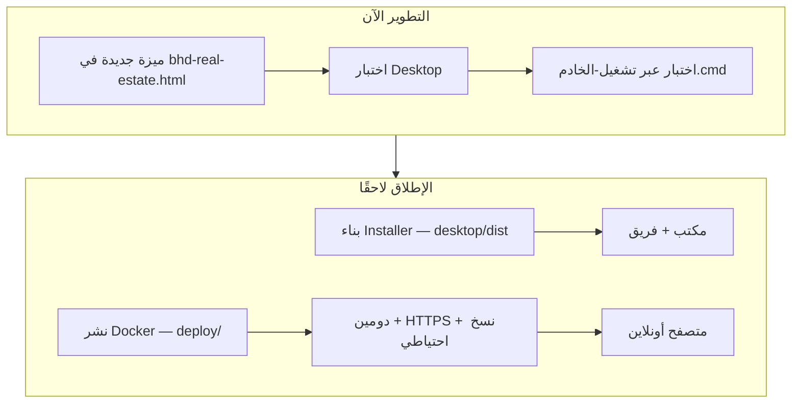

# دليل التطوير وتصحيح الأخطاء / Development & Debugging Guide

> مرافق لـ `README.md` (ما بُني) و`CONVERSATION_LOG.md` (لماذا بُني).  
> استخدم هذا الدليل إذا تكمل التصميم في Figma/أداة أخرى ثم تعود للكود، أو إذا تصلح أخطاء جديدة.

---

## 1. كيف تطوّر التطبيق بشكل صحيح

### 1.1 المبدأ الحاكم

| القاعدة | التفاصيل |
|---------|----------|
| ملف واحد | كل المنطق في `bhd-real-estate.html` — أي تغيير يمر عبره |
| لا تكسر `?mode=` | dashboard / contracts / reservations / addressbook / users / forms |
| لغة واحدة في العرض | `body.lang-ar` أو `body.lang-en` — النص الجديد: `data-ar` + `data-en` + `t(ar, en)` — **لا عربي فقط** في واجهات جديدة |
| تجاوب | كمبيوتر / iPad / هاتف — `.cursor/rules/responsive-layout-standards.mdc` |
| نوافذ موحّدة | `min(1280px, 98vw)` و`max-height: 96vh` — انظر `.cursor/rules/popup-size-standards.mdc` |
| بحث وطباعة | نفس أسلوب دفتر العناوين — `.cursor/rules/ui-search-filter-print-standards.mdc` |

### 1.2 مسار التطوير الموصى به (مراحل)



**المرحلة الحالية (معتمدة):**
1. **نفس الكود** يعمل مكتبيًا (Electron) وأونلاين (Express + SQLite) — لا نسخة ثانية من التطبيق.
2. ثبّت التصميم خارجيًا إن رغبت، ثم طبّق في `bhd-real-estate.html`.
3. اختبر **ثلاثة مسارات**: Desktop → `تشغيل-الخادم.cmd` → متصفح بدون خادم (احتياطي).
4. المحاسبة والتقارير: أكمل محرك القيود قبل الإطلاق العام.
5. قبل إطلاق داخلي: **تصدير JSON** + نسخ `data/rental.db`.

**لا تبدأ بـ:** فصل الملف إلى 20 ملفًا قبل استقرار المتطلبات — سيزيد التعقيد الآن.

### 1.2.1 أوضاع التشغيل (Hybrid)

| الوضع | كيف تعرفه | التخزين |
|-------|-----------|---------|
| **Desktop** | `getBhdRuntimeMode() === 'desktop'` | SQLite في مجلد البيانات + مرفقات على القرص |
| **Server** | فتح عبر `http://localhost:3789/` | SQLite على الخادم عبر `/api/kv` |
| **Browser** | ملف HTML مباشرة بدون API | `localStorage` + IndexedDB (محدود الحجم) |

قاعدة Cursor: `.cursor/rules/hybrid-desktop-web-deployment.mdc`

### 1.3 إضافة ميزة جديدة (قائمة تحقق)

- [ ] حدد الوضع: dashboard أم contracts أم reservations؟
- [ ] هل تحتاج `localStorage` مفتاحًا جديدًا؟ سجّله في `README.md` §10
- [ ] هل تحفظ مرفقات base64؟ خطّط للحجم (انظر §3)
- [ ] نصوص عربي/إنجليزي — **دائمًا** `t('عربي', 'English')` أو `data-ar` / `data-en` (لغة واحدة في العرض)
- [ ] اختبر على عرض ~390px (هاتف) و~768px (لوحي) إن كانت الشاشة جديدة
- [ ] هل الطباعة مطلوبة؟ استخدم `printWithSiteStandard(...)`
- [ ] Ctrl+F5 واختبر الحفظ والتنقل

---

## 2. تشغيل النظام محليًا

### 2.1 بدون خادم (الأبسط)

1. افتح الملف مباشرة:
   ```
   file:///C:/dev/عقود الايجار/bhd-real-estate.html?mode=dashboard
   ```
2. أو شغّل خادمًا ثابتًا بسيطًا (يفضل لتجنب قيود الملفات):
   ```powershell
   cd "C:\dev\عقود الايجار"
   npx --yes serve -l 8080
   ```
   ثم: `http://localhost:8080/bhd-real-estate.html?mode=dashboard`

### 2.2 تطبيق سطح المكتب (موصى به) / Desktop app

```powershell
cd "C:\dev\عقود الايجار\desktop"
npm install
npm run start
```

أو نفّذ `desktop\تشغيل-التطبيق.cmd`.

| الميزة | التفاصيل |
|--------|----------|
| API | `window.bhdDesktop` — قاعدة `rental.db` في مجلد البيانات |
| مجلد البيانات | افتراضي: `data/BHD-Real-Estate` أو Dropbox إن وُجد |
| تصدير | موافق = `exports/` داخل مجلد البيانات؛ إلغاء = حوار «اختر مكان الحفظ» |
| استيراد | حوار ملف النظام بدل `<input type="file">` |
| بناء Installer | `npm run build` → `desktop/dist/` |

عند الفتح: يُدمج `localStorage` الفارغ مع SQLite؛ عند الحفظ: `kvPutBulk` إلى القاعدة.

### 2.3 مع SQLite عبر الخادم (اختياري — متصفح)

```powershell
cd "C:\dev\عقود الايجار"
.\تشغيل-الخادم.cmd
```

- يفعّل `syncBhdKvToServer()` عند الحفظ إن كان API متاحًا.
- **لا يحل** مشكلة امتلاء `localStorage` للمرفقات الكبيرة — استخدم Desktop للإنتاج اليومي.

### 2.5 نشر أونلاين (عند الجاهزية)

**خطة السحابة الكاملة:** `docs/CLOUD_ARCHITECTURE_PLAN.md`

### 2.6 المرحلة 2A — API السحابي

```powershell
docker compose -f deploy\docker-compose.dev.yml up -d
cd apps\api
copy .env.example .env
npm install
npm run db:deploy
npm run db:seed
npm run dev
```

### 2.7 المرحلة 2B — مباني/وحدات (شفاف)

- `server/.env`: `CLOUD_API_URL=http://127.0.0.1:3790`

### 2.8 المرحلة 2C — محاسبة وعقود (شفاف)

- `/api/v1/company-data/bulk` — محاسبة، عقود، دفتر عناوين، حجوزات
- `npm run db:deploy` في `apps/api`
- التفاصيل: `apps/api/README.md`

```powershell
cd "C:\dev\عقود الايجار\deploy"
copy .env.example .env
docker compose up -d --build
```

- التطبيق: `http://SERVER:3789/bhd-real-estate.html?mode=dashboard`
- البيانات في volume `bhd_data` (لا تضيع عند إعادة بناء الصورة).
- للإنتاج الحقيقي: ضع **Nginx/Caddy** أمام الحاوية مع HTTPS ومصادقة — لم تُفعَّل بعد في الكود.

بناء تطبيق Windows للتوزيع:

```powershell
cd "C:\dev\عقود الايجار\desktop"
npm run build
```

الملف: `desktop/dist/BHD-Real-Estate-Setup.exe`

### 2.9 المرحلة 2D — مرفقات (شفاف)

- `POST /api/v1/files/upload` — رفع تلقائي عند رفع مستند (بدون UI جديد)
- Desktop يبقى أولوية؛ السحابة عند `__bhdCloudApiActive`
- `npm run migrate:files` لترحيل `file_entries` من SQLite

### 2.4 Dropbox مع الفريق

| افعل | لا تفعل |
|------|---------|
| نسخة HTML + `data/` للخادم على Dropbox | عدة أشخاص يحرّرون نفس `localStorage` في متصفحات مختلفة دون تنسيق |
| تصدير JSON دوري من «تصدير ملف بيانات» | الاعتماد على مرفقات كاملة داخل المتصفح فقط |

**التوصية:** شخص واحد «مدير بيانات» يصدّر JSON؛ الباقي يستورد أو يعمل على نسخة محلية ثم يدمج.

---

## 3. أخطاء شائعة وكيف تصححها

### 3.1 «مساحة التخزين المحلي ممتلئة» / QuotaExceeded

**السبب:** `localStorage` ~5–10 MB؛ المرفقات (بطاقات، شيكات، سندات) base64 تملأ الحصة.

**ما يفعله النظام الآن:**
1. يخفّف العقد (`tryPersistContractFullWithQuotaBackoff` مستويات 0–6).
2. يخفّف القوائم (`tryPersistStandardBhdLocalStoresBundle`).

**إذا ظهرت الرسالة رغم ذلك:**

| الخطوة | الإجراء |
|--------|---------|
| 1 | **تصدير JSON** فورًا (نسخة احتياطية) |
| 2 | لوحة → **تصفية البيانات** (كلمة مرور `1234` في الكود الحالي) — احذف حجوزات/عقود قديمة حسب النطاق |
| 3 | قلّل مرفقات **جدول الشيكات** في العقد الحالي |
| 4 | دفتر العناوين: احذف أو أعد رفع مرفقات ضخمة لسجلات قديمة |
| 5 | DevTools → Application → Local Storage → احذف مفاتيح غير ضرورية يدويًا (بحذر) |

**بعد التخفيض الناجح (⚠ + ✅):** أعد رفع المستندات/الشيكات إذا احتجت طباعة بجودة كاملة.

### 3.2 «حفظ العقد لا ينجح» بدون رسالة امتلاء

افتح **F12 → Console** ثم اضغط حفظ.

| العرض | السبب المحتمل | الحل |
|-------|---------------|------|
| نافذة «فجوات بيانات» | عقار/مالك/مستأجر ناقص | أكمل من الأزرار في النافذة |
| «مستندات إلزامية ناقصة» | JSON فارغ والواجهة قديمة | استورد من الدفتر أو أعد رفع المستند |
| لا شيء | `validateCoreData` توقف صامتًا | تحقق من التواريخ والإيجار الشهري |
| أنت في `?mode=reservations` | مسار حجز وليس عقد | حوّل الحجز أو انتقل لـ `?mode=contracts` |

**تحقق سريع في Console:**
```javascript
document.body.classList.contains('mode-reservations')  // true = مسار حجز
localStorage.getItem('bhd_contract_full')?.length
document.getElementById('contractMandatoryDocsJson')?.value
```

### 3.3 المستندات تظهر ✓ لكن الحفظ يرفض

- السبب: DOM قديم و`contractMandatoryDocsJson` فارغ.
- الحل المطبق: بعد كل `applyObjectToContractFormFields` يُستدعى `mergeMandatoryDocsFromAddressBookAfterLoadIfMatch`.
- إن استمر: من شاشة العقود أعد **استيراد المستأجر من الدفتر** أو ارفع الملف مرة أخرى.

### 3.4 الحجز يُحفظ كعقد أو العكس

| المطلوب | يجب أن يكون |
|---------|-------------|
| مسودة حجز فقط | `?mode=reservations` و`body.mode-reservations` |
| عقد كامل | `?mode=contracts` و`openContractsWorkspace()` |

لا تعتمد على بادئة `RES-` وحدها في شاشة العقود — قد يُحوَّل إلى `TC-*` عند الحفظ النهائي.

### 3.5 كل الأزرار لا تعمل / نص JavaScript ظاهر على الصفحة

**سبب تاريخي:** قوس أو backtick مكسور في template string.

**التصحيح:**
1. F12 → Console — أول خطأ syntax يحدد السطر تقريبًا.
2. ابحث في الملف عن `` ` `` غير مغلقة أو `});` ناقصة قرب دوال الطباعة/التقارير.
3. بعد الإصلاح: Ctrl+F5.

### 3.6 العدادات كلها 0 بعد التحديث

- سبب شائع: `saveDashboardAux` كان يستدعي `syncManagedUnitsFromProfiles` ويمسح `managedUnitsData`.
- إن عادت المشكلة: تأكد أن هذا الاستدعاء **ليس** في `saveDashboardAux` (انظر `CONVERSATION_LOG` #57).
- استعد من **استيراد JSON** أو Excel إن وُجدت نسخة احتياطية.

### 3.7 بعد F5 ترجع للصفحة الرئيسية

- النظام يحفظ `bhd_ui_last_mode` — إن لم يعمل: افتح الرابط مع `?mode=contracts` صراحة.
- للتصميم: اختبر دائمًا بالرابط الكامل وليس فقط من الذاكرة.

### 3.8 دفتر العناوين / الحفظ يضيع بعد التحديث

- تأكد من ظهور رسالة نجاح بعد الحفظ.
- `saveDashboardAux` يجب أن يكتب `bhd_address_book`.
- مع الخادم: تحقق أن `syncBhdKvToServer` لا يفشل صامتًا (Console).

### 3.9 تداخل الشريط العلوي مع رأس الصفحة

- عدّل `padding-top` على `body` في CSS (قيم جرى ضبطها 0.2cm–2cm حسب المحادثة).
- لا تغيّر `position: fixed` للشريط دون إعادة حساب الـ padding.

---

## 4. أدوات التشخيص (للمطور)

### 4.1 Console

```javascript
// حجم تقريبي لكل مفتاح
Object.keys(localStorage).filter(k => k.startsWith('bhd_')).map(k => ({
  key: k,
  kb: Math.round((localStorage.getItem(k)?.length || 0) / 1024)
})).sort((a,b) => b.kb - a.kb)
```

### 4.2 نقاط الدخول للحفظ

| الدالة | متى |
|--------|-----|
| `saveAllData()` | زر الحفظ الرئيسي |
| `saveDashboardAux()` | حجوزات، دفتر، ملاك — بدون العقد الكامل |
| `tryPersistContractFullWithQuotaBackoff` | داخلي — عقد |
| `tryPersistStandardBhdLocalStoresBundle` | داخلي — قوائم |

### 4.3 ملفات مساعدة في المجلد (لا تشغّل عشوائيًا)

`_patch_*.py`, `_fix_*.py`, `_insight_*.py` — سكربتات لمرة واحدة؛ قد **تفسد** الملف إن شُغّلت على نسخة قديمة. للتطوير العادي: عدّل HTML مباشرة.

---

## 5. خارطة طريق تطوير (مقترحة)

### قصير المدى (أسبوع–أسبوعان)

1. **تصميم خارجي** ثم تطبيق CSS على المكونات الموجودة.
2. استبدال `alert()` بنافذة منبثقة موحّدة للتنبيهات (نجاح/تحذير/خطأ).
3. مؤشر «حجم التخزين» في شاشة العقود (نسبة مئوية من الحصة).
4. زر «تنظيف مرفقات الدفتر فقط» دون حذف السجلات النصية.

### متوسط المدى

1. **IndexedDB** أو ملفات على الخادم للمرفقات (فصل عن JSON النصي).
2. فصل JS إلى `js/storage.js`, `js/contracts.js`, … مع بناء بسيط.
3. إكمال ترجمة النصوص القديمة أحادية اللغة.
4. ربط Dropbox عبر API رسمي (اختياري) بدل النسخ اليدوي.

### طويل المدى

1. تطبيق ويب متعدد المستخدمين مع قاعدة بيانات مركزية.
2. صلاحيات دقيقة per-building.
3. سجل تدقيق (audit) كامل لكل تعديل.

---

## 6. الانتقال إلى «برنامج تصميم آخر»

| في أداة التصميم | في الكود لاحقًا |
|-----------------|-----------------|
| `#smartSummary`, `#contractsSaveDockWrap` | نفس الـ id |
| شريط `app-top-nav` | `.app-top-nav` |
| بطاقات KPI | `.stat-card` |
| نافذة موحّدة | `.details-modal` + `.details-card` |
| لون ملكي/ماروني | `--primary`, `--doc-accent` في CSS |

**سلّم التصميم:** صدّر CSS variables + مقاسات (1280×96vh للنوافذ) + لقطات لكل `?mode=`.

---

## 7. مراجع سريعة

| الملف | المحتوى |
|-------|---------|
| `README.md` | تنفيذ تقني كامل |
| `CONVERSATION_LOG.md` | سجل طلبات المستخدم مرحلة بمرحلة |
| `SYSTEM_REFERENCE.md` | وحدات النظام والمفاتيح الأساسية |
| `.cursor/rules/*.mdc` | قواعد إلزامية للوكيل |

---

*آخر تحديث: 2026-06-04*
