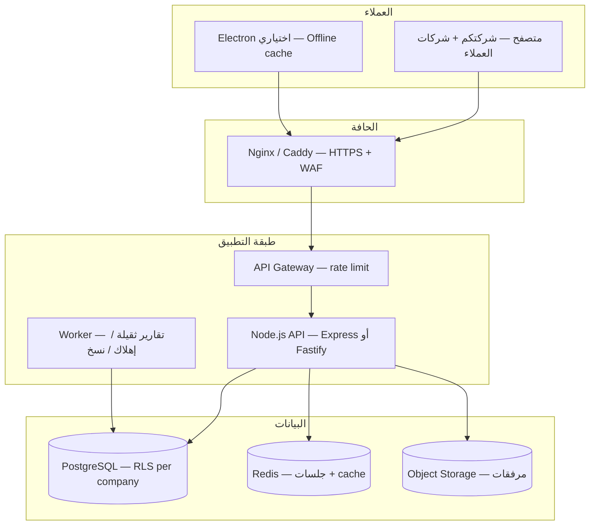

# BHD Real Estate Cloud — خطة المرحلة 2 التقنية

> **الغرض:** تحويل النظام الحالي (SPA + `kv_store`) إلى منصة سحابية متعددة الشركات (SaaS) تدعم شركتكم الآن (~100 عقار / 10,000 وحدة / 15 مستخدماً) وتتوسع لاحقاً نحو ملايين الوحدات و500,000+ مستخدم عبر شركات معزولة.
>
> **المرجع الحالي:** `bhd-real-estate.html` + `desktop/` (Electron) + `server/` (Express + SQLite).
>
> **تاريخ الوثيقة:** 2026-06-17

---

## 0. مبدأ الترقية الشفافة (إلزامي)

**المستخدم يرى نظاماً واحداً — لا يرى البنية.**

| ✅ يبقى كما هو | ❌ لا يُضاف للواجهة |
|----------------|---------------------|
| نفس الشاشات والقوائم | «وضع مكتبي / سحابة / خادم» |
| نفس أزرار الحفظ والطباعة | اختيار مصدر البيانات |
| نفس مسارات العمل (حجز → عقد → محاسبة) | مسارات ملفات أو PostgreSQL |
| رسائل تشغيل بسيطة («تم تحديث النظام») | تشخيص تقني في الهيدر |

**التنفيذ:** طبقة `BhdDataStore` بين الواجهة والـ backend؛ `apps/api` JSON فقط؛ Desktop/`server/` يبقيان لعرض HTML حتى اكتمال الربط.

قاعدة Cursor: `.cursor/rules/transparent-upgrade-architecture.mdc`

---

## 1. ملخص تنفيذي

| البعد | الوضع الحالي | الهدف (المرحلة 2) |
|-------|--------------|-------------------|
| نموذج البيانات | JSON ضخم في `kv_store` (~40 مفتاحاً) | جداول PostgreSQL مُطبَّعة + JSONB للحقول المرنة فقط |
| الشركات | شركة واحدة ضمنيّاً | **Multi-tenant:** `company_id` على كل سجل |
| المستخدمون | `bhd_users_registry` في المتصفح | جلسات JWT/ cookies + صلاحيات **server-side** |
| التزامن | حفظ bulk — آخر كتابة تغلب | معاملات + قفل تفاؤلي + سجل تدقيق |
| المرفقات | قرص (مكتبي) / base64 (متصفح) | تخزين كائنات (S3-compatible) لكل شركة |
| الواجهة | ملف HTML واحد | **نفس الواجهة** تدريجياً عبر API بدل `localStorage` |

**مبدأ الحفاظ على الاستثمار:** المنطق التجاري (عقود، حجوزات، محاسبة، تقارير) يُستخرج من HTML الحالي؛ ما يُستبدَل هو **طبقة التخزين والمزامنة والأمان** فقط.

---

## 2. معمارية مستهدفة



### 2.1 عزل الشركات (Multi-tenancy)

**النموذج المعتمد:** قاعدة واحدة + **`company_id` على كل جدول** + **Row Level Security (RLS)** في PostgreSQL.

| البديل | لماذا لا نعتمده الآن |
|--------|---------------------|
| قاعدة لكل شركة | صعب الإدارة عند 10,000+ شركة |
| Schema لكل شركة | تعقيد الهجرات والنسخ الاحتياطي |

**قواعد صارمة:**
- كل استعلام API يمر عبر `SET app.current_company_id = $1` (أو ORM middleware).
- RLS policy: `company_id = current_setting('app.current_company_id')::uuid`.
- اختبارات تلقائية: مستخدم شركة A **لا يقرأ أبداً** بيانات شركة B.

### 2.2 هوية المستخدم

```
users           — حساب عالمي (email فريد)
company_users   — عضوية: user_id + company_id + role + permissions
companies       — بيانات الاشتراك والباقة
sessions        — refresh tokens (Redis)
```

- تسجيل دخول → اختيار شركة (إن كان المستخدم في أكثر من شركة).
- JWT قصير العمر (15 دقيقة) + refresh token (7–30 يوم).
- صلاحيات موروثة من النظام الحالي: `manage_contracts`, `accounting`, … — لكن **تُفرض في API** وليس في الواجهة فقط.

---

## 3. مخطط PostgreSQL (نواة المرحلة 2)

> الإصدارات عبر **Prisma** أو **node-pg-migrate**. الأرقام تقديرية للمرحلة الأولى من السحابة.

### 3.1 المنصة

```sql
-- شركات / مستأجرو SaaS
CREATE TABLE companies (
  id            UUID PRIMARY KEY DEFAULT gen_random_uuid(),
  slug          TEXT NOT NULL UNIQUE,          -- subdomain: acme.bhd-realestate.com
  name_ar       TEXT,
  name_en       TEXT,
  plan_code     TEXT NOT NULL DEFAULT 'trial',
  max_users     INT NOT NULL DEFAULT 20,
  max_units     INT NOT NULL DEFAULT 15000,
  status        TEXT NOT NULL DEFAULT 'active', -- active | suspended | trial
  created_at    TIMESTAMPTZ NOT NULL DEFAULT now(),
  updated_at    TIMESTAMPTZ NOT NULL DEFAULT now()
);

CREATE TABLE users (
  id            UUID PRIMARY KEY DEFAULT gen_random_uuid(),
  email         TEXT NOT NULL UNIQUE,
  password_hash TEXT,
  display_name  TEXT,
  locale        TEXT DEFAULT 'ar',
  created_at    TIMESTAMPTZ NOT NULL DEFAULT now()
);

CREATE TABLE company_users (
  company_id    UUID NOT NULL REFERENCES companies(id) ON DELETE CASCADE,
  user_id       UUID NOT NULL REFERENCES users(id) ON DELETE CASCADE,
  role          TEXT NOT NULL,                 -- admin | staff | accountant | portal
  permissions   JSONB NOT NULL DEFAULT '[]',
  is_active     BOOLEAN NOT NULL DEFAULT true,
  PRIMARY KEY (company_id, user_id)
);
```

### 3.2 العقارات والعقود

```sql
CREATE TABLE buildings (
  id            UUID PRIMARY KEY DEFAULT gen_random_uuid(),
  company_id    UUID NOT NULL REFERENCES companies(id),
  name          TEXT NOT NULL,
  status        TEXT,
  profile       JSONB NOT NULL DEFAULT '{}',   -- حقول مرنة من buildingProfiles الحالي
  created_at    TIMESTAMPTZ NOT NULL DEFAULT now(),
  UNIQUE (company_id, name)
);
CREATE INDEX idx_buildings_company ON buildings(company_id);

CREATE TABLE units (
  id            UUID PRIMARY KEY DEFAULT gen_random_uuid(),
  company_id    UUID NOT NULL REFERENCES companies(id),
  building_id   UUID NOT NULL REFERENCES buildings(id) ON DELETE CASCADE,
  unit_no       TEXT NOT NULL,
  floor         TEXT,
  unit_type     TEXT,
  status        TEXT,
  managed_meta  JSONB NOT NULL DEFAULT '{}',
  UNIQUE (company_id, building_id, unit_no)
);
CREATE INDEX idx_units_company_building ON units(company_id, building_id);

CREATE TABLE contracts (
  id            UUID PRIMARY KEY DEFAULT gen_random_uuid(),
  company_id    UUID NOT NULL REFERENCES companies(id),
  unit_id       UUID NOT NULL REFERENCES units(id),
  tenant_id     UUID REFERENCES parties(id),
  agreement_no  TEXT,
  status        TEXT NOT NULL,
  payload       JSONB NOT NULL,                -- بقية حقول العقد من النظام الحالي
  start_date    DATE,
  end_date      DATE,
  monthly_rent  NUMERIC(14,3),
  is_current    BOOLEAN NOT NULL DEFAULT true,
  created_at    TIMESTAMPTZ NOT NULL DEFAULT now()
);
CREATE INDEX idx_contracts_company_unit ON contracts(company_id, unit_id);
CREATE INDEX idx_contracts_end_date ON contracts(company_id, end_date) WHERE is_current;
```

### 3.3 الأطراف والمحاسبة

```sql
CREATE TABLE parties (
  id            UUID PRIMARY KEY DEFAULT gen_random_uuid(),
  company_id    UUID NOT NULL REFERENCES companies(id),
  party_type    TEXT NOT NULL,                 -- owner | tenant | vendor | company
  data          JSONB NOT NULL,                -- صف دفتر العناوين
  created_at    TIMESTAMPTZ NOT NULL DEFAULT now()
);
CREATE INDEX idx_parties_company_type ON parties(company_id, party_type);

CREATE TABLE accounting_accounts (
  id            UUID PRIMARY KEY DEFAULT gen_random_uuid(),
  company_id    UUID NOT NULL REFERENCES companies(id),
  code          TEXT NOT NULL,
  name_ar       TEXT,
  name_en       TEXT,
  parent_id     UUID REFERENCES accounting_accounts(id),
  account_type  TEXT,
  UNIQUE (company_id, code)
);

CREATE TABLE accounting_journal_entries (
  id            UUID PRIMARY KEY DEFAULT gen_random_uuid(),
  company_id    UUID NOT NULL REFERENCES companies(id),
  entry_date    DATE NOT NULL,
  reference     TEXT,
  status        TEXT NOT NULL DEFAULT 'posted',
  source_type   TEXT,                          -- receipt | cheque | invoice | manual
  source_id     UUID,
  created_at    TIMESTAMPTZ NOT NULL DEFAULT now()
);

CREATE TABLE accounting_journal_lines (
  id            UUID PRIMARY KEY DEFAULT gen_random_uuid(),
  company_id    UUID NOT NULL REFERENCES companies(id),
  entry_id      UUID NOT NULL REFERENCES accounting_journal_entries(id) ON DELETE CASCADE,
  account_id    UUID NOT NULL REFERENCES accounting_accounts(id),
  debit         NUMERIC(14,3) NOT NULL DEFAULT 0,
  credit        NUMERIC(14,3) NOT NULL DEFAULT 0,
  cost_center_id UUID,
  party_id      UUID,
  memo          TEXT
);
CREATE INDEX idx_jl_company_entry ON accounting_journal_lines(company_id, entry_id);
CREATE INDEX idx_jl_company_account ON accounting_journal_lines(company_id, account_id);
```

### 3.4 الملفات والتدقيق

```sql
CREATE TABLE file_objects (
  id            UUID PRIMARY KEY DEFAULT gen_random_uuid(),
  company_id    UUID NOT NULL REFERENCES companies(id),
  storage_key   TEXT NOT NULL,                 -- s3://bucket/companies/{id}/...
  file_name     TEXT,
  mime_type     TEXT,
  byte_size     BIGINT,
  building_id   UUID,
  unit_id       UUID,
  doc_type      TEXT,
  created_at    TIMESTAMPTZ NOT NULL DEFAULT now()
);

CREATE TABLE audit_log (
  id            BIGSERIAL PRIMARY KEY,
  company_id    UUID NOT NULL,
  user_id       UUID,
  action        TEXT NOT NULL,
  entity_type   TEXT,
  entity_id     UUID,
  meta          JSONB,
  created_at    TIMESTAMPTZ NOT NULL DEFAULT now()
);
CREATE INDEX idx_audit_company_time ON audit_log(company_id, created_at DESC);
```

### 3.5 RLS (مثال)

```sql
ALTER TABLE units ENABLE ROW LEVEL SECURITY;
CREATE POLICY units_tenant_isolation ON units
  USING (company_id = current_setting('app.current_company_id', true)::uuid);
```

---

## 4. تصميم API

**الأساس:** REST JSON تحت `/api/v1/` — نفس النطاق (same-origin) عند النشر.

### 4.1 مصادقة

| Method | Path | الوصف |
|--------|------|--------|
| POST | `/auth/login` | email + password → tokens |
| POST | `/auth/refresh` | refresh token |
| POST | `/auth/logout` | إبطال الجلسة |
| GET | `/auth/me` | المستخدم + الشركات المتاحة |
| POST | `/auth/select-company` | `{ companyId }` → JWT بسياق الشركة |

### 4.2 موارد العقارات (أمثلة)

| Method | Path | ملاحظات |
|--------|------|---------|
| GET | `/buildings?page=&limit=&search=` | ترقيم صفحات إلزامي |
| GET | `/buildings/:id/units?page=&limit=` | لا تُرجع 10,000 صف دفعة واحدة |
| GET | `/units/summary` | أرقام لوحة التحكم (مجمّعة في SQL) |
| GET | `/units/:id` | تفاصيل وحدة + عقد حالي |
| POST | `/contracts` | إنشاء/تحديث عبر معاملات |
| GET | `/contracts/expiring?days=30` | تقارير |

### 4.3 محاسبة

| Method | Path |
|--------|------|
| GET | `/accounting/accounts` |
| GET | `/accounting/journals?page=` |
| POST | `/accounting/journals` |
| GET | `/accounting/reports/trial-balance?from=&to=` |
| GET | `/accounting/reports/bank-ledger?accountId=` |

### 4.4 مرفقات

| Method | Path |
|--------|------|
| POST | `/files/presign` | رابط رفع مباشر إلى S3 |
| GET | `/files/:id/url` | رابط قراءة مؤقت |
| DELETE | `/files/:id` |

### 4.5 عقود API مع الواجهة الحالية

**طبقة توافق انتقالية:**

```javascript
// بدل: localStorage.getItem('bhd_managed_units')
await bhdApi.get('/units', { page: 1, limit: 100, buildingId });

// بدل: scheduleBhdKvToServer() bulk
await bhdApi.patch('/units/:id', delta);  // تحديث جزئي فقط
```

إنشاء **`bhd-api-client.js`** (لاحقاً داخل HTML أو ملف منفصل) يحاكي دوال القراءة/الكتابة الحالية تدريجياً.

---

## 5. هجرة البيانات من النظام الحالي

### 5.1 مراحل الهجرة


### 5.2 سكربت الهجرة (مخطط `tools/migrate-kv-to-pg.js`)

1. قراءة `kv_store` أو ملف JSON مصدّر.
2. إنشاء `company` واحدة (شركتكم).
3. تحويل:
   - `bhd_buildings_list` + `bhd_building_profiles` → `buildings`
   - `bhd_managed_units` → `units`
   - `bhd_saved_contracts_by_unit` → `contracts`
   - `bhd_address_book` → `parties`
   - `bhd_accounting_registry` → حسابات + قيود (من `entries` + `journals` المُعاد بناؤها)
4. مرفقات القرص → رفع إلى S3 مع `file_objects`.
5. تقرير فروقات: عدد الوحدات، إجمالي الإيجار، أرصدة محاسبية.

### 5.3 التشغيل المتوازي (فترة انتقالية)

- أسبوع 1–2: قراءة من PostgreSQL + كتابة مزدوجة إلى kv (للرجوع).
- أسبوع 3+: كتابة PostgreSQL فقط.
- إيقاف `server/index.js` القديم بعد التحقق.

---

## 6. البنية التحتية للنشر

### 6.1 مرحلة «شركتكم فقط» (15 مستخدماً)

| المكوّن | المواصفة المقترحة |
|---------|-------------------|
| VPS / Cloud VM | 4 vCPU, 8–16 GB RAM |
| PostgreSQL | Managed (RDS / Neon / Supabase) أو على نفس VM مع نسخ يومي |
| Redis | 1 GB — جلسات |
| Object storage | 100 GB — Backblaze B2 / AWS S3 / MinIO |
| CDN | اختياري للـ HTML الثابت |

**التكلفة التقريبية:** 80–250 USD/شهر حسب المزود.

### 6.2 مرحلة SaaS (عشرات الشركات)

- فصل API عن Worker.
- نسخ PostgreSQL read replica للتقارير.
- Queue (BullMQ / SQS) للمهام الثقيلة.

### 6.3 مرحلة النطاق الكبير (500K مستخدم / 10M وحدة)

> لا يُبنى دفعة واحدة — معالم تدريجية.

| التحدي | الحل |
|--------|------|
| 10M وحدة | فهرسة `(company_id, building_id, unit_no)` + pagination إلزامي في كل قائمة |
| تقارير ثقيلة | materialized views لكل شركة + Worker ليلي |
| 500K مستخدم | Redis cluster + stateless API (أفقي التوسع) |
| مرفقات | CDN + lifecycle policies |
| شركات ضخمة | نقل شركات >1M وحدة إلى **shard** DB منفصل (خيار متأخر) |

---

## 7. الأمان والامتثال

- HTTPS إلزامي (Let's Encrypt).
- كلمات مرور: bcrypt/argon2.
- Rate limiting على `/auth/login`.
- نسخ احتياطي: PostgreSQL يومي + ملفات أسبوعي + اختبار استعادة شهري.
- سجل تدقيق لكل تعديل عقد/سند/قيد.
- GDPR/خصوصية: تصدير بيانات الشركة + حذف عند إلغاء الاشتراك.

---

## 8. خارطة زمنية مقترحة

| المرحلة | المدة | المخرجات |
|---------|-------|----------|
| **2A — أساس API** | 8–10 أسابيع | PostgreSQL + auth + buildings/units/contracts CRUD + RLS |
| **2B — واجهة متصلة** | 6–8 أسابيع | لوحة التحكم + العمليات عبر API (بدون bulk kv) |
| **2C — محاسبة سحابية** | 8–12 أسبوع | قيود + تقارير من SQL |
| **2D — ملفات + هجرة** | 4–6 أسابيع | S3 + سكربت هجرة شركتكم |
| **2E — إطلاق داخلي** | 2–3 أسابيع | 15 مستخدماً — اختبار حمل |
| **3 — SaaS تجاري** | 3–6 أشهر | تسجيل شركات + باقات + فوترة |

**المجموع التقريبي حتى إطلاق شركتكم أونلاين:** 7–9 أشهر بفريق صغير (1–2 مطورين بدوام كامل).

---

## 9. هيكل المستودع المقترح (لاحقاً)

```
bhd-real-estate/
  apps/
    web/              # الواجهة (تدريجياً من bhd-real-estate.html)
    api/              # Express/Fastify + Prisma
    worker/           # تقارير / إهلاك / بريد
  packages/
    shared-types/     # DTOs مشتركة
  tools/
    migrate-kv-to-pg.js
  desktop/            # يبقى — يتصل بـ API أو SQLite محلي
  docs/
    CLOUD_ARCHITECTURE_PLAN.md  # هذه الوثيقة
```

---

## 10. معايير قبول المرحلة 2 (شركتكم)

- [ ] 15 مستخدماً متزامنين دون فقدان بيانات (اختبار حمل).
- [ ] 10,000 وحدة — فتح لوحة التحكم < 3 ثوانٍ.
- [ ] عزل: شركة تجريبية ثانية لا ترى بيانات شركتكم.
- [ ] موازنة محاسبية: مدين = دائن على التقارير الرئيسية.
- [ ] نسخ احتياطي واستعادة خلال < 4 ساعات RTO.
- [ ] مرفقات تُرفع وتُطبع دون تضمين base64 في DB.

---

## 11. ما يُنفَّذ الآن

| الحالة | البند |
|--------|-------|
| ✅ | تحسينات المرحلة 1 (تخزين مؤقت + ترقيم صفحات 10k وحدة) |
| ✅ **2A** | `apps/api` — PostgreSQL + JWT + مباني/وحدات + RLS |
| ✅ **2B** | ربط السحابة — مباني/وحدات + جلسة شفافة في HTML |
| ✅ **2C** | `company-data` — محاسبة/عقود/KV + هجرة `migrate:kv` |
| ✅ **2D** | مرفقات — رفع/قراءة + `migrate:files` + S3 اختياري |
| ✅ **2E** | SaaS — باقات + تسجيل API + أعضاء + حدود + انتهاء تجربة |
| 🔄 **مسار A** | إطلاق شركتكم — `docs/LAUNCH_PATH_A.md` + أدوات verify/load/migrate |
| ⏳ **3** | فوترة + تسجيل عام + محاسبة normalized في PG |

---

## 12. قرارات مفتوحة (للمراجعة معكم)

1. **Subdomain لكل شركة** (`acme.bhd.com`) أم مسار (`bhd.com/acme`)؟
2. **فوترة:** Stripe أم بوابة محلية؟
3. **Electron مستقبلاً:** offline-first مع مزامنة أم متصفح فقط؟
4. **اللغة الافتراضية للـ API errors:** عربي أم إنجليزي أم كلاهما؟

---

*الوثيقة حية — تُحدَّث مع كل معلم في مشروع السحابة.*
